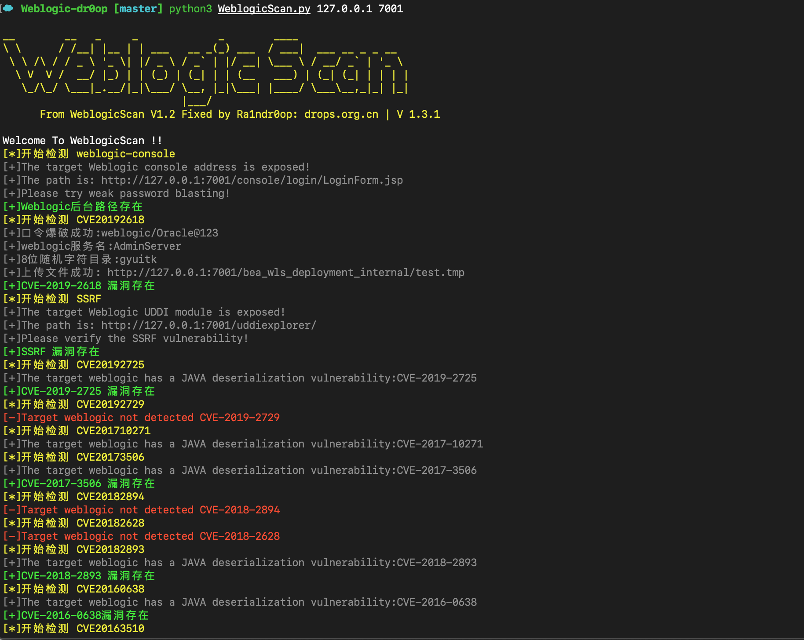

# WeblogicScan

增强版WeblogicScan 从WeblogicScan V1.2 版本修改而来。



# DEFF

* 支持Python3
* 修复漏洞检测误报，漏洞检测结果更精确
* 添加CVE-2019-2729, CVE-2019-2618漏洞检测
* 插件化漏洞扫描组件
* 添加彩色打印

# INSTALL

```
pip3 install -r requirements.txt
```

# Useage

```
python3 WeblogicScan.py 192.168.1.1 7001
```

# 支持CVE

* CVE-2014-4210

* CVE-2016-0638

* CVE-2016-3510

* CVE-2017-3428

* CVE-2017-3506

* CVE-2017-10271

* CVE-2018-2628

* CVE-2018-2893

* CVE-2018-2894

* CVE-2019-2618

* CVE-2019-2725

* CVE-2019-2729

  

  # EXTENDS

  如果想添加其他CVE或其他Weblogic漏洞，只需要按照如下规则填写插件即可：

  ```python
  #!/usr/bin/env python
  # _*_ coding:utf-8 _*_
  
  import logging
  import sys
  import requests
  
  from ..platform import ManageProcessor,Color
  
  logging.basicConfig(filename='Weblogic.log',
                      format='%(asctime)s %(message)s',
                      filemode="w", level=logging.INFO)
  
  headers = {'user-agent': 'ceshi/0.0.1'}
  
  
  @ManageProcessor.plugin_register('CVE201XXXXX')
  class CVE201XXXXX(object):
      def process(self,ip,port):
          self.run(ip,port)
  
      def run(self,url,port):
          ......
          your POC payload ......
          if (success):
  						 print(Color.OKGREEN+'[+]CVE201XXXXX 漏洞存在'+Color.ENDC)
  ```

  

并在 `app/plugins/__init__.py`下添加文件名即可。

`__init__.py`

```
#!/usr/bin/env python
# _*_ coding:utf-8 _*_

__all__ = ['WeblogicConsole', 'CVE-2019-2618','CVE-2014-4210','CVE-2019-2725','CVE-2019-2729','CVE-2017-10271','CVE-2017-3506','CVE-2018-2894','CVE-2018-2628','CVE-2018-2893','CVE-2016-0638','CVE-2016-3510','CVE-2017-3248','CVE-201X-XXXX']
```


# Thanks

感谢Daybreak的CVE-2019-2618 检测脚本
